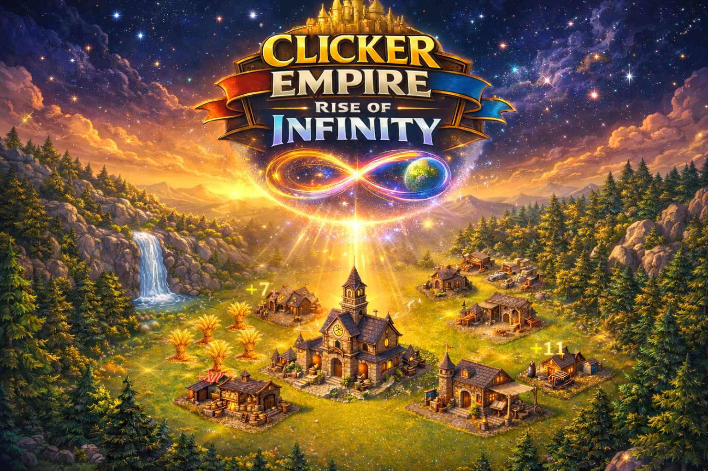

# Clicker Empire: Rise of Infinity

  

  

---

## 🏛 What Is Clicker Empire?

**Clicker Empire: Rise of Infinity (CEROF)** is an evolving idle civilization simulator built in Unity.

You start with a small settlement.  
You harvest finite resources.  
You automate production.  
You balance your economy.  
You expand your civilization.

But this is not just a clicker game.

It is a systemic economic simulation where every resource affects another — and imbalance creates pressure.

---

## 🎮 Core Gameplay Features

- 🌲 Finite resource nodes (Wood, Stone, Food, Gold)
- 🏗 Building placement on isometric grid
- ⚙ Automated production via centralized GameTick system
- 📊 Resource caps & economic tradeoffs
- 🧠 Harmony system (derived systemic stability)
- 🗺 Expandable architecture (City → World → Planet → Galaxy)

---

## 🧩 Design Philosophy

Clicker Empire is built around five pillars:

- **Living Economy** – Nothing is infinite.
- **Spatial Strategy** – Placement matters.
- **Systemic Balance** – Harmony over brute force growth.
- **Layered Architecture** – Micro to macro simulation.
- **Civilizational Evolution** – Multiple development paths.

The goal is long-term evolution:

Idle Incremental → Strategic City Builder → Civilization Simulator → Galactic Economy System

---

## 🚀 Play the Game

👉 **Play the latest WebGL build here:**

https://alorbla.itch.io/clickerempire

No download required.

---

## 🏗 Technical Stack

- Unity (2D Isometric)
- UI Toolkit
- ScriptableObject-driven systems
- Centralized GameTick architecture
- Git-based version control workflow
- Modular scalable design

---

## 🔮 Long-Term Vision

City Harmony influences World Harmony.  
World Harmony influences Planetary balance.  
Planetary balance shapes Galactic systems.

Nothing exists in isolation.

---

## 📌 Development Status

Active development.

Current systems implemented:
- Core resource management
- Finite nodes
- Building placement
- Idle production (Lumberjack)
- Build menu UI
- Harmony foundation logic

Planned systems:
- World hex layer
- City specialization
- Era progression
- Bandits & defense
- Multi-city empire
- Planet modifiers
- Galactic layer

---

## 👑 Creator

Created by Matej Petruška  
(Alorbla / Shizukana Yume)

---

### Rise. Balance. Expand.  
### The Empire is Never Finished.